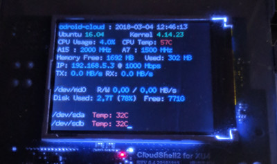

CloudShell lcd script
=====================

This is a modified version of the original [cloudshell-lcd](https://wiki.odroid.com/accessory/add-on_boards/xu4_cloudshell2/xu4_cloudshell2#enable_lcd_and_fan) ([source](http://bazaar.launchpad.net/~kyle1117/+junk/cloudshell-lcd/view/head:/bin/cloudshell-lcd)) script, created by [Kyle Lee](mailto:cont2dev@gmail.com).

Displays the usage of `/dev/md0` and the temperature of `/dev/sda` and `/dev/sdb` seperately.

License: GPL-2.0+

